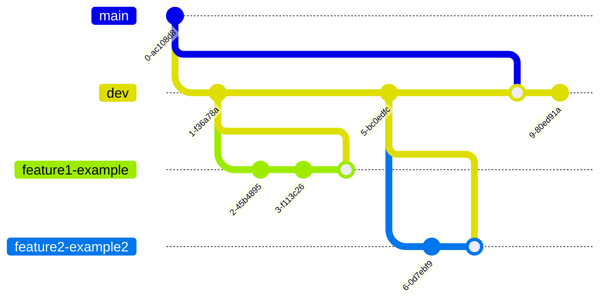

# Driver's Logbook (React Native) 

Introducing the Digital Driver's Trip Tracker App, a must-have for all drivers!
This app is built using the latest technologies from the React Native ecosystem. Say goodbye to manual log keeping and hello to hassle-free tracking of your trips.

With a sleek and user-friendly interface, the app accurately records your trip details, including the start and end location, distance traveled, and duration. All your trips are saved and organized in one place, making it easy for you to keep track of your driving history.

Whether you're a professional driver or just need to track your personal trips, this app is perfect for you. With its advanced features, you can focus on the road while we take care of the rest. Download the Digital Driver's Trip Tracker App today and start your journey to a more organized driving experience!

> check out individual screenshots in [doc/screenshots](/doc/screenshots)

- [Driver's Logbook (React Native)](#drivers-logbook-react-native)
  - [Learn More](#learn-more)
  - [Repository Navigation](#repository-navigation)
  - [Try Demo](#try-demo)
  - [Definitive List of Implemented Features](#definitive-list-of-implemented-features)
  - [Getting Started (local development)](#getting-started-local-development)
  - [Git Workflow](#git-workflow)

---

## Learn More

For more in-depth info including architecture and design:
* read [the report](doc/report/app_report.pdf).
* Check out the [presentation](https://p2.zemanec.me/).

## Repository Navigation

* [doc](/doc/) : documentation 
  * `design`: UML diagrams, architecture, sequence diagrams, use-cases 
  * `presentation`: Final Presentation 
  * `report`: PDF report 
  * `screenshots`: Snapshot images of the App in different stages
  * `testing` : document listing manually carried out E2E test scenarios 
* [src](/src/) : source code

## Try Demo 

Scan the QR code using your smart phone to try the app on your device.

> Note: The app requires [Expo Go](https://expo.dev/expo-go) to run. Currently iOS version of the app restricts access to app the account of the developer, therefore the app can be run only on Android devices.

---

## Definitive List of Implemented Features 

| Feature                          | Description                                                                                                                                                                                                                                                                                                    |
| -------------------------------- | -------------------------------------------------------------------------------------------------------------------------------------------------------------------------------------------------------------------------------------------------------------------------------------------------------------- |
| Guided image capture             | Each trip starts and ends by taking an image of odometer. User is guided to take an image such that the value of the odometer is visible in masked rectangular area.                                                                                                                                           |
| Image Manipulation               | Captured image is cropped to fit the intended area and compressed by factor of 0.75                                                                                                                                                                                                                            |
| Azure Computer Vision OCR        | Recognizes textual content from sent image and returns results to the app                                                                                                                                                                                                                                      |
| Azure Blob Storage               | Remotely saves captured & processed images, that can be later retrieved                                                                                                                                                                                                                                        |
| Odometer Image Proof             | In trip history (home tab), each trip has a button to download and display the images and optionally to store these images on device                                                                                                                                                                           |
| Retrieving location              | The app utilizes the device's location services to determine the current location when the odometer picture is taken.                                                                                                                                                                                          |
| Elapsed time of trip in progress | When Trip is in progress the user see clock updated in real time, informing about how long it has been since the start of the trip                                                                                                                                                                             |
| Bottom Navigation                | Navigates between tabs a.k.a. secondary pages (Overview, Saved Places, Profile, Settings)                                                                                                                                                                                                                      |
| Persisting Trip                  | when a new trip is in progress it is kept in memory until it is ended, after ending the trip each trip is persisted in local storage                                                                                                                                                                           |
| Pagination                       | trips are organized using sequence numbers, enabling storing trips as separate entities in the database resulting in better performance                                                                                                                                                                        |
| Chronological sort of trips      | sorted from the latest trip by default, this can be changed to sort from the oldest loaded trip                                                                                                                                                                                                                |
| Load More Trips                  | By default only 5 trips are loaded in Overview, if more trips are available 5 more can be loaded, until there are no more trips left                                                                                                                                                                           |
| Edit Existing Trip               | In admin mode, each field of the stored trip can be edited  (start location, end location, start odometer, end odometer, start time, end time) such that updated value is not in conflict with potential previous or next value. Each trip has a 3-dot button to access the updating menu.                     |
| Editing trip summary             | The final step in creating a new trip is displaying a summary of the trip's data. Each field, including the Start Location, End Location, Start Odometer, End Odometer, Start Time, and End Time, can be revised before confirming, ensuring that the updated value does not conflict with any previous trips. |
| Delete Existing Trip             | Each trip can be deleted from the local storage                                                                                                                                                                                                                                                                |
| Simple Trip Share                | Information about each trip can be shared individually in a textual form using native share dialog                                                                                                                                                                                                             |
| Export Trips in CSV              | transforms trip information to a CSV file that can then be shared using native share dialog                                                                                                                                                                                                                    |
| Export Trips in JSON             | transforms trip information to a JSON file that can then be shared using native share dialog                                                                                                                                                                                                                   |
| Export Backup                    | exports local storage in it’s entirety including trips, saved places and user information as JSON file.                                                                                                                                                                                                        |
| Restore from backup              | Exported backup file can be used to recover to a snapshot of database                                                                                                                                                                                                                                          |
| Saved Places                     | User can create and edit list of frequently visited locations. These can be then used to adjust location of the trip.                                                                                                                                                                                          |
| Vehicle Information              | On Profile screen user can store and edit information about his vehicle (Vehicle name, license plate, km until service, km until oil change, vignette expiration date and type of tires)                                                                                                                       |
| Local Storage                    | For performance benefits the app uses native database of the device through the JavaScript abstraction Local Storage, storing only textual JSON data.                                                                                                                                                          |
| Data Protection                  | All data are owned by the user. Except for the remotely stored images, all data are stored locally on the device.                                                                                                                                                                                              |
| Offline mode                     | App can be used without connection to the internet for viewing and editing functionalities, for creating trips the internet connection is required (guarding prompt is displayed)                                                                                                                              |
| Experimental Mode                | In this mode, the app selects the recognized value automatically, or if recognition fails, it attempts to select the value of the last trip, saving the user several steps when creating a trip.                                                                                                               |
| Demo Mode                        | Demo mode allows the user to test features of the app with mocked data (trips, locations and odometer values).                                                                                                                                                                                                 |
| Debug Mode                       | For a developer the debug mode allows for logging capabilities (log latest trip, dump contents of database, purging database and restarting the app).                                                                                                                                                          |

## Getting Started (local development)

To Try The App on Physical Device Download Expo Go
* [Android](https://play.google.com/store/apps/details?id=host.exp.exponent&pli=1) 
* [iOS](https://apps.apple.com/app/expo-go/id982107779)

1. Install [Node LTS release](https://nodejs.org/en/)
2. Install [GIT](https://git-scm.com/)
3. Install [yarn](https://yarnpkg.com/cli/install)
4. Install dependencies run `yarn`
5. Install and run metro server (expo) `npx expo start` alternatively run `yarn start`
6. Photograph QR code using device with installed Expo Go or type `a` to run in an Android Simulator ([must be set up seperately by installing Android Studio](https://reactnative.dev/docs/environment-setup))

---

## Git Workflow 

