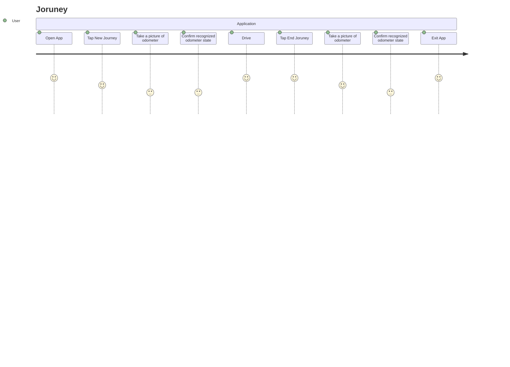
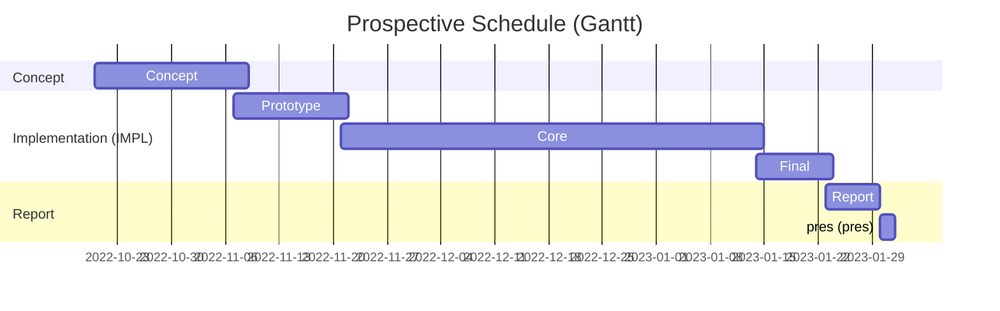

# Documentation 

* `design`: UML diagrams, architecture, sequence diagrams, use-cases 
* `presentation`: Final Presentation 
* `report`: PDF report 
* `screenshots`: Snapshot images of the App in different stages
* `testing` : document listing manually carried out E2E test scenarios 

---

## User Jorney

---

## Time Plan

