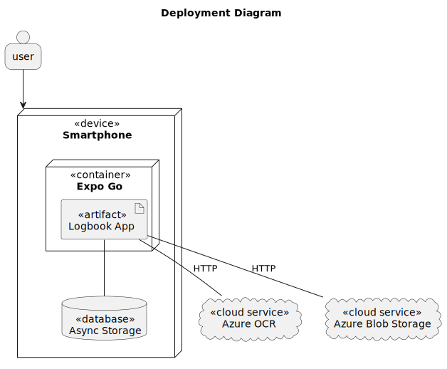
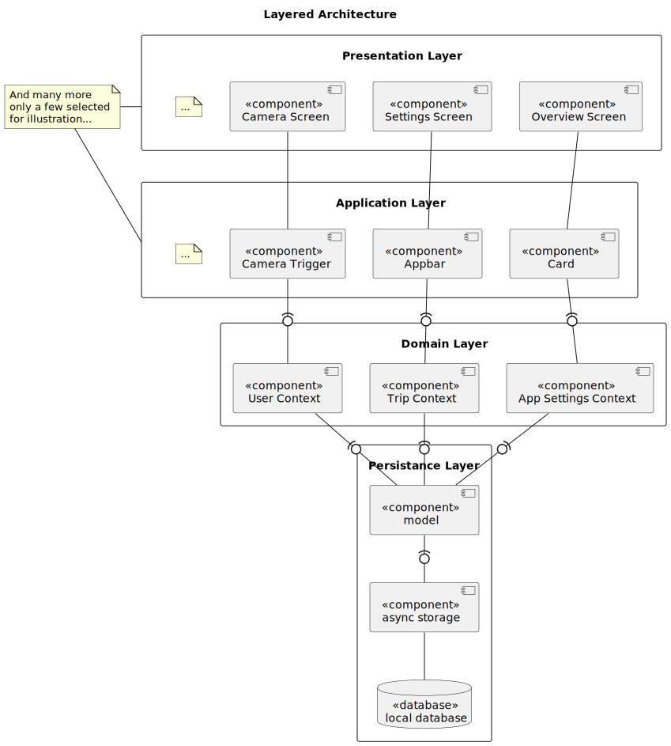
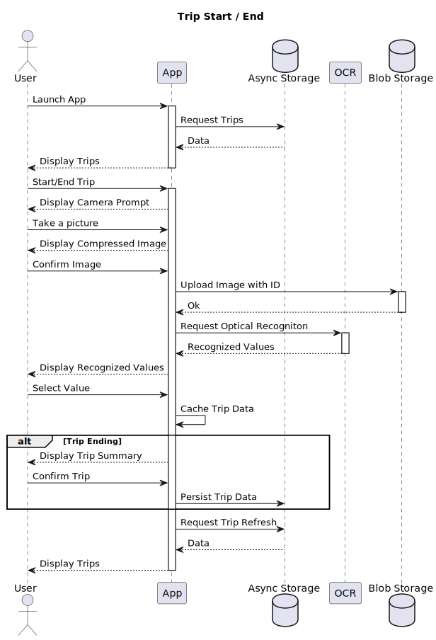

<!-- .slide: data-background-gradient="radial-gradient(#6877ca,#3f51b5)" -->

<!-- .element: class="r-stretch" -->

# Driver's Logbook

 **React Native App**
 <!-- .element: class="r-fit-text" -->

**Hynek Zemanec**

January 31, 2023

Note:

## Agenda 

1. Background <!-- .element: class="fragment" data-fragment-index="1" -->
2. Tech Stack <!-- .element: class="fragment" data-fragment-index="2" -->
3. Architecture <!-- .element: class="fragment" data-fragment-index="3" -->
4. Demo <!-- .element: class="fragment" data-fragment-index="4" -->

note: 

What is on the menu today? 

---

# Ask Anything 

[sli.do/3343801](https://sli.do/3343801)<!-- .element: class="r-fit-text" -->

---

# Background 

Note: 

===

  
  

<!-- .element: class="r-stretch" -->

Note: 

===

    
    
    
    

Note: 
Android apps are powered by Java and more recently Kotlin.

iOS apps are powered by Objective C and more recently Swift.

Completely different worlds.

Unless you have a huge capital or you have genious employees that you plan to burn out, this is a big problem.

===

    
    
    

Note: 
You need to use or at least download different IDEs.

For iOS you need Mac OS to compile.

So what now? 

Should we just throw our hands in the air and wave them like we just don't care?

===

<!-- .slide: data-background="#282c34" -->
<video autoplay="true" loop="true" muted width="400" style="border-radius: 12px;">
    <source src="/vid/ReactNativevp9.webm" type="video/webm">
</video>

Note: 

===

<!-- .element: style="border-radius:12px;" -->

---

# Tech Stack 

===

  

  <!-- .element: class="r-stretch" -->
  
  <!-- .element: class="r-stretch" -->

Note: 
So, yeah that's exactly what I did.

===

<!-- .element: class="r-stretch" -->

===

<!-- .element: class="r-stretch" -->

===

<!-- .element: class="r-stretch" -->

## Jest

<!-- .element: class="r-stretch" -->

## Async Storage

<!-- .element: class="r-stretch" -->

## React navigation

<!-- .element: style="filter:drop-shadow(4px 6px 30px #000);" -->

## Microsoft Azure Computer Vision

<!-- .element: class="r-stretch" -->

## Microsoft Azure Blob Storage

<!-- .element: class="r-stretch" -->

---

# Architecture 

===

<!-- .element: style="border-radius:12px;" -->

===

<!-- .element: style="border-radius:12px;" -->
<!-- .element: class="r-stretch" -->

===

<!-- .element: style="border-radius:12px;" -->
<!-- .element: class="r-stretch" -->
---

<!-- .element: class="r-stretch" -->

---

# Resources 

  <ul style="text-align:left;">
    <li><a href="https://git01lab.cs.univie.ac.at/p2/2022ws/12010957-hynek-zemanec">Code</a></li>
    <li><a href="https://drive.google.com/file/d/1_G8qfq_usFVZsONUl-UNc-AABMDsyS0z/view?usp=sharing">Report</a></li>
    <li><a href="mailto:zemanech@gmail.com">zemanech@gmail.com</a></li>
  </ul>
  

<!-- .element: class="r-stretch" -->

---

# Demo

<!-- .element: style="border-radius:12px;" -->
<!-- .element: class="r-stretch" -->

