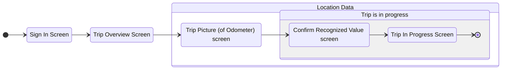
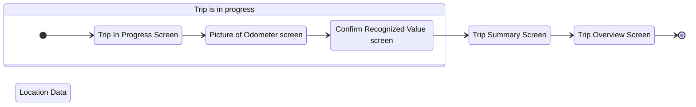
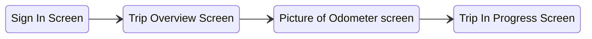
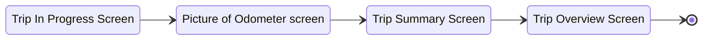

# Drivers Logbook App (React Native)

## Architecture 

* `model`: layer abstracting direct communication with Data Store
* `routes` : paths to screens and navigation related components 
* `contexts` : controlling layer using methods from model, represents global state management separated by various contexts 
* `screens` : rendered screens, encapsulating containers for components 
* `components`: single-purpose reusable pieces of UI 
* `theme` : global styling settings for the design system
* `api` : subscriptions and calls to back-end infrastructure
* `assets` : available static resources 
* `routes` : screen routing logic, separation of primary and secondary screens

# App User Scenarios

> Below are depicted the main application user flows, i.e. envisioned ideal progression on the screen by screen basis 

## Normal Mode

> also viable for demo mode

### Trip Start Progression

## Remote Debugging in VS Code

> note: Accessing dev tools in Expo Go within Android Emulator is via shortcut `ctrl` + `m`

1. install `react-native-tools` extension
2. in VS Code settings set `react-native-port` to `19001`
3. start metro server (expo) `yarn start` 
4. start emulator (make sure remote debugging is disabled)
5. Start debugger in VS Code (`F5`)
6. (`ctrl` + `m`) + enable remote debugging 

### Trip End Progression

## Experimental Mode 

> assumes OCR recognition is correct, skips Confirmation step

### Trip Start 

### Trip End 

